# Production AI Agent System


> **A production-grade conversational AI agent that combines Google Gemini Pro with Secure Cloud Code Execution.**

This system overcomes the limitations of traditional LLMs by giving them **tools** and a **body**. It doesn't just hallucinate code; it writes it, executes it in a secure, isolated cloud environment, and iterates on errors.

---

## 🌟 Why is this different?

Most AI agents are just chatbots. This system is a **Computational Agent**.

| Feature | Standard Chatbot | ⚡ Our Agent System |
| :--- | :--- | :--- |
| **Code Execution** | ❌ None (or hallucinated) | ✅ **Real-time output** in E2B encryption sandboxes |
| **Dependencies** | ❌ Limited to simple logic | ✅ **Full Data Science Stack** (Pandas, Scikit-learn) |
| **Memory** | ❌ Context window only | ✅ **Persistent Session Memory** stored on disk |
| **Speed** | 🐢 Slow setup per chat | 🚀 **Instant-Start** custom Docker containers |

---

## 🏗️ Architecture Blueprint

### High-Level Flow

The system operates on an **Orchestrator Pattern**. The Agent is the brain, deciding *when* to speak and *when* to work.

```mermaid
graph TD
    User-->|Message| Agent
    
    subgraph "Orchestrator Core"
        Agent[🤖 Agent Controller]
        Memory[💾 Conversation Memory]
        Planner[🧠 Decision Engine]
    end
    
    Agent <--> Memory
    Agent --> Planner
    
    Planner -->|Reasoning| Gemini[✨ Google Gemini API]
    Planner -->|Need Action| Executor[🛠️ Tool Executor]
    
    Executor -->|Code| E2B[📦 E2B Cloud Sandbox]
    Executor -->|Files| Storage[📂 Local/Cloud Storage]
    
    E2B -->|Result| Executor
    Executor -->|Output| Agent
    Agent -->|Final Response| User
```



### Sequence of Operations

1.  **Input**: User asks "Analyze this dataset."
2.  **Reasoning**: Gemini generates Python code.
3.  **Execution**: Code is sent to a pre-warmed E2B sandbox.
4.  **Result**: Sandbox returns stdout/stderr/charts.
5.  **Response**: Agent interprets the result and explains it to the user.

---

## ⚡ Power Under the Hood: Custom Sandboxes

We don't use generic containers. We use **Specialized Data Science Runtime** (`en7sb4k1n268scs49jnj`).

```mermaid
sequenceDiagram
    participant Agent
    participant E2B Cloud
    participant Sandbox Container

    Note right of Agent: User sends request
    Agent->>E2B Cloud: Request Sandbox (Template: en7sb4k1n268...)
    E2B Cloud->>Sandbox Container: 🚀 Boot Application (milliseconds)
    Note over Sandbox Container: Pre-loaded: NumPy, Pandas, Sklearn
    
    Agent->>Sandbox Container: Execute Code
    Sandbox Container-->>Agent: Returns Result
```



---

## 🚀 Quick Start Guide

### 1. Requirements
*   Python 3.10 or higher
*   `pip` or `uv` (recommended)
*   **API Keys**:
    *   [Google AI Studio](https://aistudio.google.com) (Gemini)
    *   [E2B Dashboard](https://e2b.dev) (Sandboxes)

### 2. Installation

```bash
# Clone and enter
git clone <repo-url>
cd sandbox-system

# Install dependencies (fastest way)
uv pip install -r requirements.txt
```

### 3. Configuration

Create your environment file:

```bash
cp .env.example .env
```

**Edit `.env`**:
```ini
GEMINI_API_KEY=AIzaSy...
E2B_API_KEY=e2b_...
# LOG_LEVEL=INFO  (Optional)
```

### 4. Launch

```bash
python main.py
```

---

## 📂 Project Structure

A clean, modular codebase designed for extensibility.

```
sandbox-system/
├── main.py                     # 🏁 Entry Point
├── orchestrator/               # 🧠 Brains of the operation
│   ├── core/                   # Agent logic, memory, planning
│   ├── providers/              # External API wrappers (Gemini, E2B)
│   ├── tools/                  # Tool definitions & execution
│   └── utils/                  # Reusable helpers (logging, retry)
├── registry/                   # 📋 Configuration
│   └── tools/                  # YAML definitions for tools
├── storage/                    # 💾 Persistent data (sessions)
├── docs/                       # 📚 Detailed Documentation
└── scripts/                    # 🔧 Maintenance scripts
```

---

## 🛠️ Management & Utilities

| Task | Command | Description |
| :--- | :--- | :--- |
| **Start Agent** | `python main.py` | Launches the interactive CLI chat. |
| **Cleanup** | `python scripts/cleanup_sandboxes.py` | Kills all active E2B sandboxes to save cost. |
| **Verify** | `python scripts/verify.py` | Checks imports and configuration health. |
| **Map System** | `python scripts/map_connections.py` | Generates a visualization of system components. |

---

## 📚 Reference Documentation

*   **[System Architecture](docs/ARCHITECTURE.md)**: Deep dive into the code modules.
*   **[Project Overview](docs/PROJECT_OVERVIEW.md)**: High-level summary "for humans".
*   **[E2B Integration Guide](docs/e2b_guide.md)**: How the sandbox provider works.

---

## 🤝 Contribution

Running into issues?

1.  **Check Logs**: Look at `logs/` directory for detailed execution traces.
2.  **Verify Keys**: Ensure `.env` is loaded (the script will warn you if not).
3.  **Rebuild**: If code fails inside sandbox, check if you need to rebuild the template (see docs).

*Built with ❤️ using Gemini 2.0 and E2B.*
